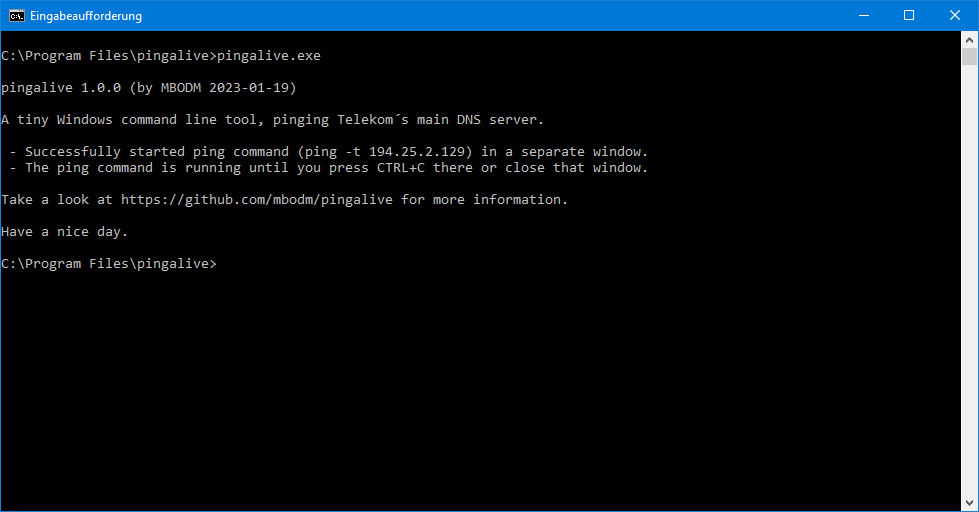

# pingalive
A tiny command line tool for Windows, infinitely pinging a specific server (written in Rust).



### What it is
- It´s a very tiny (~50 lines of code) command line executable for Windows.
- When executed, it endlessly pings a specific server, until closed.
- It´s used for internet connection testing, for my personal use.

### How it works
- It just executes the Windows `ping.exe` with `-t 194.25.2.129` as parameters.
- The IP address (`194.25.2.129`) is Telekom´s* main DNS server.
- The `ping.exe` process is running standalone, in a separate window.

*Telekom is the largest ISP company in Germany. Their main DNS server is a rather stable and longliving server (since nearly 30 years now). The IP address of that server has never changed (and will never, in my opinion). Therefore i´m using this specific IP address.

### Why it exists
I wasn´t able to successfully add a batch file (`.bat`) or a link (`.lnk`) to the Windows 10 Taskbar. At least not in a way it works properly (maybe i´m just too stupid, but all tries had some issues). So i decided to quickly write a tiny executable doing that job instead. Then i was able to add that executable to the Taskbar, without any problems. That´s the sole reason why this tool exists. :grin:

### Requirements

- 64-bit Windows

There aren´t any other special requirements. The tool is written in Rust and the release binaries are natively compiled with `rustc` for the Windows x64 platform, assuming you are using some 64-bit Windows (and that's quite likely).

### Notes
- The tool is written in Rust
- Used Rust version is `rustc 1.65.0`
- Release binaries are compiled with `cargo`/`rustc` on a 64-bit Windows 10 machine
- Used Windows OS version is `Windows 10 Pro 21H2 Build 19044.2486`
- The tool is developed with `VS Code 1.74.2` (with active `rust-analyzer` extension)
- The tool is using a `cmd.exe /c start ping.exe` approach.
- Approach-Reason1: Issues with Rust´s `BufRead` and non-UTF8 Windows console.
- Approach-Reason2: Need for `ctrlc`, or `windows-rs` & `SetConsoleCtrlHandler`.
- Sadly i forgot what Sean Connery teached us: "_One ping only!_".

The release binaries are compiled with following compiler options in `cargo.toml` file:
```rust
[profile.release]
opt-level = 'z'     # Optimize for size.
lto = true          # Enable Link Time Optimization.
codegen-units = 1   # Reduce number of codegen units to increase optimizations.
panic = 'abort'     # Abort on panic.
strip = true        # Strip symbols from binary.
```

#### Have fun.
